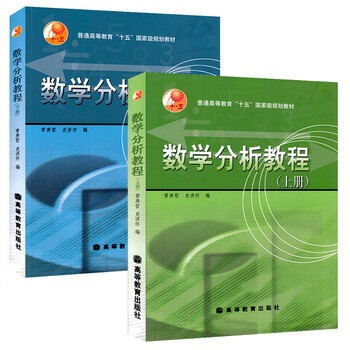

## 说明

这是中科大《数学分析》第2版所有课后题的解答。这是比较老的版本，里面有一些用不到的章节。

第一章：实数和数列的极限（[第一章答案](../static/chapter1.pdf)）

第二章：函数的连续性（[第二章答案](../static/chapter2.pdf)）

第三章：函数的导数（[第三章答案](../static/chapter3.pdf)）

第四章：Taylor定理（[第四章答案](../static/chapter4.pdf)）

第五章：差值与逼近初步（无）（[第五章答案](../static/chapter5.pdf)）

第六章：求导的逆运算（[第六章答案](../static/chapter6.pdf)）

第七章：函数的积分（[第七章答案](../static/chapter7.pdf)）

第八章：曲线的表示和逼近（无）（[第八章答案](../static/chapter8.pdf)）

第九章：数项级数（[第九章答案](../static/chapter9.pdf)）

第十章：函数列和函数级数（[第十章答案](../static/chapter10.pdf)）

第十一章：反常积分（[第十一章答案](../static/chapter11.pdf)）

第十二章：Fourier分析（[第十二章答案](../static/chapter12.pdf)）

第十三章：多变量函数的连续性（[第十三章答案](../static/chapter13.pdf)）

第十四章：多变量函数的微分学（[第十四章答案](../static/chapter14.pdf)）

第十五章：曲面的表示与逼近（无）（[第十五章答案](../static/chapter15.pdf)）

第十六章：多重积分（[第十六章答案](../static/chapter16.pdf)）

第十七章：曲线积分（[第十七章答案](../static/chapter17.pdf)）

第十八章：曲面积分（[第十八章答案](../static/chapter18.pdf)）

第十九章：场的数学（[第十九章答案](../static/chapter19.pdf)）

第二十章：含参变量积分（[第二十章答案](../static/chapter20.pdf)）

## 合集

