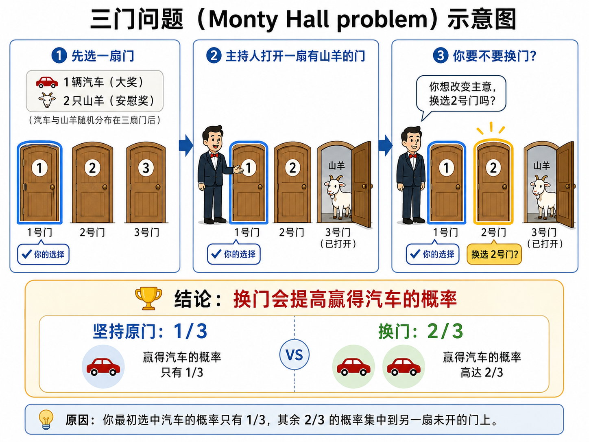

# 三门问题

**三门问题（Monty Hall problem）**，又称蒙提霍尔悖论，是一个源自美国电视游戏节目《Let's Make a Deal》的经典概率问题。

### 🎲 问题简述

假设你正在参加一个游戏节目，你面前有三扇关闭的门。

- 其中一扇门后面是一辆**汽车**（大奖）。
- 另外两扇门后面各是一只**山羊**（安慰奖）。

游戏规则如下：

1. 你首先选择一扇门（假设你选了1号门），但这扇门暂时不打开。
2. 知道门后秘密的主持人，会在剩下的两扇门中，打开一扇**后面是山羊**的门（假设他打开了3号门）。
3. 此时，主持人会问你：“**你想改变主意，换选2号门吗？**”

**核心问题：** 换门会增加你赢得汽车的概率吗？

**结论：** **必须换！** 坚持不换的胜率是 $1/3$，而换门的胜率会翻倍，达到 **$2/3$**。

以下是对该游戏的一个示意图：

{width="700"}

### 🧮 数学原理推导

很多人直觉上认为，既然只剩下两扇门，一扇是车一扇是羊，那么无论换不换，胜率都是 50%。这是一个经典的直觉陷阱。我们可以通过两种方式来推导真实的概率。

#### 方法一：穷举法（直观逻辑）

我们假设你一开始就决定了“无论如何都要换门”，来看看会发生什么：

- **情况 1：你一开始挑中了“汽车”（概率 $1/3$）**

  主持人被迫打开一扇有羊的门。如果你换门，你必然换到另一只羊。**（换门必输）**

- **情况 2：你一开始挑中了“羊 A”（概率 $1/3$）**

  主持人被迫打开另一扇有羊的门（羊 B）。如果你换门，你必然换到剩下的那辆汽车。**（换门必赢）**

- **情况 3：你一开始挑中了“羊 B”（概率 $1/3$）**

  主持人被迫打开另一扇有羊的门（羊 A）。如果你换门，你必然换到剩下的那辆汽车。**（换门必赢）**

综上所述，如果你采取“换门”策略，只有在你一开始就盲狙命中汽车（概率 $1/3$）时才会输；只要你一开始选错（概率 $2/3$），换门就**必定**能让你赢。因此，换门的胜率是 $2/3$。

#### 方法二：贝叶斯定理（数学本质）

我们可以用条件概率来严格证明：**换门的胜率是不换门的两倍。**

点击下方链接，可阅读贝叶斯定理的证明（[三门问题](../static/三门问题.pdf)）。