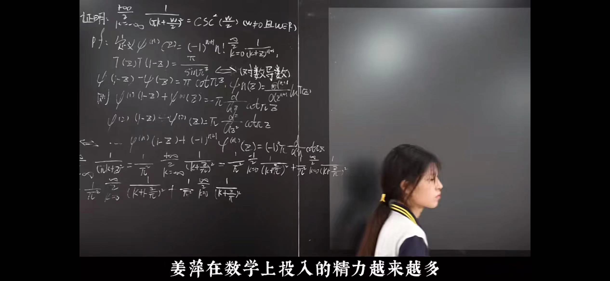

# 那道“姜萍做的”级数题

## 背景

24年6月，江苏省涟水中等专业学校17岁服装专业学生姜萍以**93分、全球第12名**的成绩晋级阿里巴巴全球数学竞赛决赛，从而引起热议。

最开始我是相信她是天才的，因为我看到了黑板上的完整步骤，如果这个步骤真的是她做出来的，那么她肯定是天才无疑，有几个人17岁就会gamma函数？没想到我也看走了眼，这是她抄的……尼玛的

以下是我对黑板上推证步骤的解释。附带2个稍微“初等一些”的方法。

{ width="700" }

**题目：**证明：$\displaystyle \sum_{k=-\infty}^{+\infty}{\frac{1}{(k\pi+\frac{\omega}{2})^{2}}} = \csc^2 \left(\frac{\omega}{2}\right)\quad (\omega \neq 0 \text{且}\omega \in \mathbb R)$

## 黑板上的解法

根据：

$$
\psi^{(n)}(z)=(-1)^{n+1}n!\sum_{k=0}^{+\infty}{\frac{1}{(k+z)^{n+1}}}
$$

> 式中$\psi(z)$是Gamma函数的对数的一阶导函数，称为Digamma函数。
>
> Gamma函数是一类含参变量的广义积分，它的定义如下，它在数理方程中，就和初等数学中$\sin$和$\cos$一样常见，是基本的工具。
>
> 
> $$
> \displaystyle \Gamma (z) = \int_{0}^{+\infty}{t^{z-1}\mathrm e^{-t}\mathrm dt} \quad (z>0)
> $$
> 
>
> Digamma函数（Gamma函数的对数的导数）就定义为：$\displaystyle\psi(z)=\frac{\mathrm d}{\mathrm dz}\ln\Gamma(z)$
>
> $\psi(z)$的$n$阶导数有如下性质，这是已经证明好的结论：
>
> 
> $$
> \displaystyle \psi^{(n)}(z)=\frac{\mathrm d^{n+1}}{\mathrm dz^{n+1}}\ln\Gamma(z)=(-1)^{n+1}n!\sum_{k=0}^{+\infty}{\frac{1}{(k+z)^{n+1}}}
> $$
> 
>
> 那么：​
>
> - 当$n=1$时，有：$\displaystyle \psi'(z)=\sum_{k=0}^{+\infty}{\frac{1}{(k+z)^{2}}}$​
> - 用$1-z$代入$z$有：$\displaystyle \psi'(1-z)=\sum_{k=0}^{+\infty}{\frac{1}{(k+1-z)^2}}$ 

由于：$\displaystyle \Gamma(z)\Gamma(1-z)=\frac{\pi}{\sin \pi z}$ 

> 这个叫做余元公式，它是Gamma函数的性质之一，推证过程挺复杂的，但余元公式就直接拿来用就行了。她写对数导数，就是先求对数，再求导数：

取对数：$\ln \Gamma(z) + \ln \Gamma(1-z) =  \ln \pi - \ln \sin \pi z$

求一阶导数：$\psi(1-z)-\psi(z) = \pi \cot \pi z$ 

继续做下去，成立一些递推式：
$$
\begin{equation*}
\psi'(1-z)+\psi'(z) = -\pi \frac{\mathrm d}{\mathrm dz} \cot \pi z \\
\psi''(1-z)-\psi''(z) = \pi \frac{\mathrm d^2}{\mathrm dz^2} \cot \pi z \\
\vdots \\
\displaystyle \psi^{(n)}(1-z)+(-1)^{n+1}\psi^{(n)}(z) = (-1)^n\pi \frac{\mathrm d^n}{\mathrm dz^n} \cot \pi z
\end{equation*}
$$

> 这些递推式是用不到的，这只是姜萍的思考的过程。有用的是第一个递推式，因为它出现了$\csc x$：
>
> 
> $$
> \displaystyle \psi'(1-z)+\psi'(z) = -\pi \frac{\mathrm d}{\mathrm dz} \cot \pi z = \pi^2\csc^2 \pi z \label{eq:exs} \tag 1
> $$

接下来：

$$
\sum_{k=-\infty}^{+\infty}{\frac{1}{(k\pi+z)^{2}}} = \frac{1}{\pi^2}\sum_{k=-\infty}^{+\infty}{\frac{1}{(k+\frac{z}{\pi})^{2}}}= \frac{1}{\pi^2}\sum_{k=-\infty}^{-1}{\frac{1}{(k+\frac{z}{\pi})^{2}}} + \frac{1}{\pi^2}\sum_{k=0}^{+\infty}{\frac{1}{(k+\frac{z}{\pi})^{2}}}
$$

【有的下标写错了，正常现象】

$$
=\frac{1}{\pi^2}\sum_{k=0}^{+\infty}{\frac{1}{(k+1-\frac{z}{\pi})^{2}}}+ \frac{1}{\pi^2}\sum_{k=0}^{+\infty}{\frac{1}{(k+\frac{z}{\pi})^{2}}}
$$

【前面的做一个下标的变换】

> 写到这里就没了，接下来自然是利用$\psi'(x)$的性质和第一个递推式(1):

$$
=\frac{1}{\pi^2}\left(\psi'(1-\frac{z}{\pi})+\psi'(\frac{z}{\pi})\right) =\frac{1}{\pi^2}\left(\pi^2\csc^2(\pi \cdot \frac{z}{\pi})\right) = \csc^2 z
$$

这样就证明了级数恒等式：$\displaystyle \sum_{k=-\infty}^{+\infty}{\frac{1}{(k\pi+z)^{2}}} = \csc^2 z$

最后令$\displaystyle z=\frac{m}{2}$，就证好了。

## 方法二

根据$\displaystyle\frac{\sin x}{x}$的无穷乘积展开：$\displaystyle \frac{\sin x}{x}=\prod_{n=1}^{\infty}{\left(1-\frac{x^2}{(n\pi)^2}\right)}$

可知：$\displaystyle\sin x=x\cdot\prod_{n=1}^{\infty}{\left(1-\frac{x^2}{(n\pi)^2}\right)}$

由于：$(\ln \sin x)'=\cot x$，对上式求对数后逐项求导，可得：

$$
\cot x = \frac{1}{x}+\sum_{n=1}^{\infty}{\frac{2x}{x^2-(n\pi)^2}}=\sum_{n=-\infty}^{+\infty}{\frac{1}{x+n\pi}}
$$

由于：$(\cot x)' = -\csc^2 x$，对上式做$\displaystyle -\frac{\mathrm d}{\mathrm dx}$​，即得：

$$
\csc^2 x = -\frac{\mathrm d}{\mathrm dx}\left(\sum_{n=-\infty}^{+\infty}{\frac{1}{x+n\pi}}\right)=\sum_{n=-\infty}^{+\infty}{\frac{1}{(x+n\pi)^2}}
$$

## 方法三

以下内容来自中科大数学分析Fourier分析一章，属于Fourier级数的副产物。

#### 求$\cos ax$的展开式

将$f(x)=\cos ax,\,(a \notin \mathbb Z)$在$[-\pi,\pi]$上展开为Fourier级数。

函数周期为$\displaystyle \frac{2\pi}{a}$，偶函数，将$f$延拓为数轴上周期为$2\pi$的函数。计算系数如下：

$$
\begin{align*} a_n &= \frac{2}{\pi}\int_0^\pi{\cos ax \cos nx \mathrm dx} \\ &= \frac{1}{\pi}\int_0^\pi{\big(\cos (a-n)x+ \cos (a+n)x\big) \mathrm dx} \\ &= \frac{1}{\pi}\left( \frac{\sin(a-n)\pi}{a-n}+\frac{\sin(a+n)\pi}{a+n}\right) \\&= \frac{1}{\pi}\left( \frac{(-1)^n\sin a\pi}{a-n}+\frac{(-1)^n\sin a\pi}{a+n}\right) \\ &= \frac{(-1)^n \sin a\pi}{\pi}\left( \frac{2a}{a^2-n^2}\right) \quad (n = 0,1,2,\cdots)\end{align*}
$$

$$b_n = 0\quad (n=1,2,\cdots)$$ 因为是偶函数

因此，$\displaystyle \cos ax = \frac{\sin a\pi}{\pi}\frac{1}{a}+\sum_{n=1}^{\infty}{\frac{(-1)^n \sin a\pi}{\pi}\left( \frac{2a}{a^2-n^2}\right)\cos nx},\quad x\in[-\pi,\pi]$

即：$\displaystyle \cos ax = \frac{\sin a\pi}{\pi}\left(\frac{1}{a}+\sum_{n=1}^{\infty}{(-1)^n \frac{2a}{a^2-n^2}\cos nx}\right),\quad x\in[-\pi,\pi]$

#### 令$x=\pi$，得到$\cot x$的展开式

可得：$\displaystyle \cos a\pi = \frac{\sin a\pi}{\pi}\left(\frac{1}{a}+\sum_{n=1}^{\infty}{\frac{2a}{a^2-n^2}}\right)$

即：$\displaystyle \cot a\pi = \frac{1}{\pi}\left(\frac{1}{a}+\sum_{n=1}^{\infty}{\frac{2a}{a^2-n^2}}\right)$

让$a\pi = x$，由于$a\notin \mathbb Z$，那么$x\neq 0,\pm\pi,\pm2\pi,\cdots$，有：

$$
\cot x = \frac{1}{x} + \frac{1}{\pi}\sum_{n=1}^{\infty}{\frac{2(\frac{x}{\pi})}{(\frac{x}{\pi})^2-n^2}} = \frac{1}{x}+\sum_{n=1}^{\infty}{\frac{2x}{x^2-(n\pi)^2}}
$$

这样得到$\cot x$的展开式：

$$
\cot x = \frac{1}{x}+\sum_{n=1}^{\infty}{\frac{2x}{x^2-(n\pi)^2}},\quad (x\neq 0,\pm\pi,\pm2\pi,\cdots)
$$
$$\displaystyle $$​

#### 求导，得到$\csc^2 x$的展开式

$$
\csc^2 x = \sum_{n\in\mathbb Z}{\frac{1}{(x+n\pi)^2}},\quad (x\neq 0,\pm\pi,\pm2\pi,\cdots)
$$

#### 令$x=0$，得到$\csc x$的展开式

$$
\frac{\pi}{\sin a\pi} = \frac{1}{a}+\sum_{n=1}^{\infty}{(-1)^n \frac{2a}{a^2-n^2}},\quad a \notin \mathbb Z
$$

同样的，让$a\pi = x$，同样$x\neq 0,\pm\pi,\pm2\pi,\cdots$，可得：

$$
\csc x = \frac{1}{x}+\sum_{n=1}^{\infty}{(-1)^n\frac{2x}{x^2-(n\pi)^2}},\quad (x\neq 0,\pm\pi,\pm2\pi,\cdots)
$$
