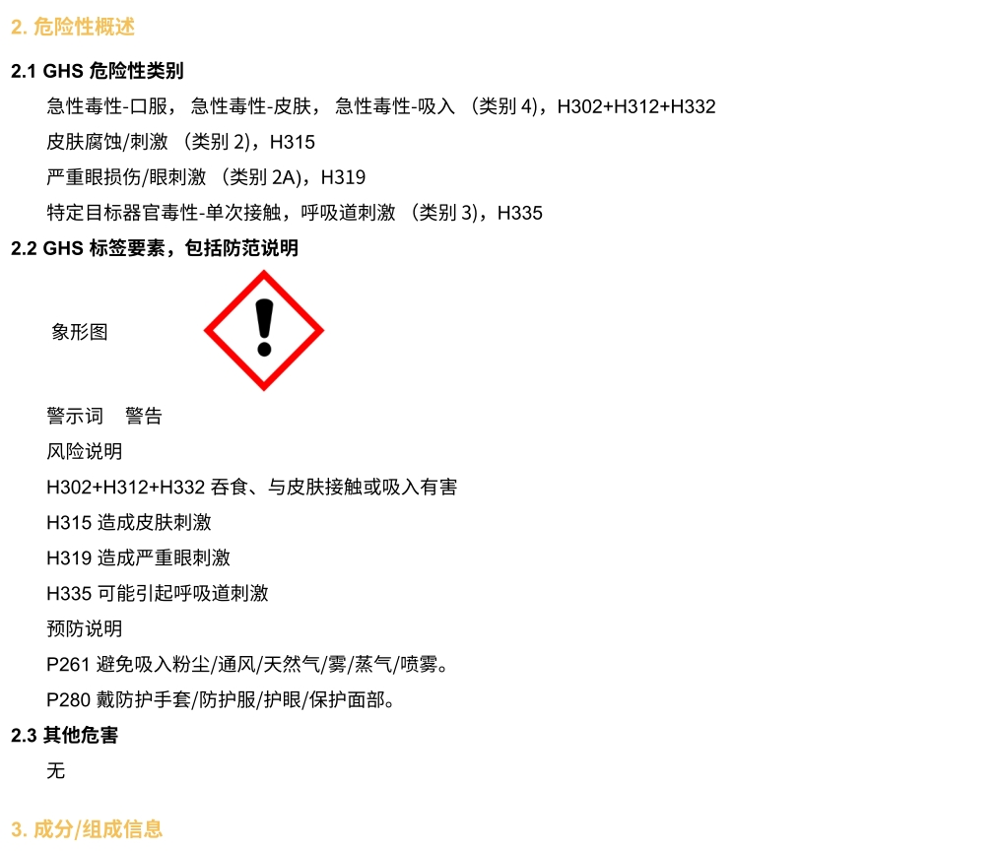

# 化学品毒性数据库

我们需要建立所有涉及到的试剂的毒性列表，以及接触后紧急处预案。

## 皮肤染色事件

4-甲氧基-2-吡啶甲醛，熔点低（28-30℃），稍微加热即变为黄色液体，其结构如下。

{ width="200" }

可以渗透过丁腈手套，让手指染色。

{ width="700" }

如果手指被染色，处理方法为：

- ‌立即冲洗‌：用大量清水冲洗接触部位至少15分钟，避免摩擦。‌

- ‌中和处理‌：若皮肤出现红肿、疼痛，可尝试用中性肥皂水或生理盐水进一步清洁。‌

- ‌观察症状‌：若出现持续刺痛、瘙痒、脱皮或过敏反应（如荨麻疹），需及时就医。‌

- ‌防护措施‌：后续操作建议佩戴丁腈+橡胶手套，避免直接接触。‌