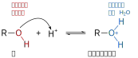

# 题目A002

## 反应

{width="530"}

## 机理

{width="700"}

步骤细则：

A: Activation of the carbonyl group by protonation. 通过质子化活化羰基。

B: Addition of EtOH to the activated carbonyl group. 乙醇进攻活化后的羰基。

C: Deprotonation of the oxonium ion. 氧鎓离子去质子化。【注意在这个步骤中，电子对是怎么转移的？】

D: Protonation makes a hydroxyl group a good leaving group. 质子化使羟基成为良好的离去基团。【这里和羟基的E1消除机理有点类似，羟基是很差的离去基团，质子化之后，变成$\ce{H2O}$，则是很好的离去基团了。

{width="500"}

弱碱，是最好的离去基团。$\ce{HO-}$是强碱，是很坏的离去基团。

| 酸           | $\ce{pKa}$ | 共轭碱        | 离去能力   |
| ----------- | ---------- | ---------- | ------ |
| $\ce{H3O+}$ | $-1.7$ | $\ce{H2O}$ | 好的离去基团 |
| $\ce{H2O}$  | $15.7$     | $\ce{HO-}$ | 坏的离去基团 |

反应例：叔丁醇消除，生成异丁烯。

{width="600"}

E: Elimination of water helped by the oxygen lone pair. 在氧原子孤对电子的协助下，水分子离去。

F: Deprotonation 去质子化。