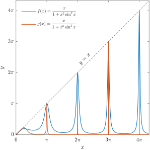

# ch2-9-1 一个反常性质函数

## 题目

研究函数的一致连续性：

$$
f(x)=\frac{x}{1+x^2\sin^2x},\quad x\geqslant 0.
$$

这一个很不一般的函数，它具有一系列反常的性质。

## 证明

函数在$[0,+\infty)$上不一致连续。取：

$$
s_n = n\pi,\qquad t_n = n\pi + \frac{1}{n}\quad (n\in \mathbf N^*)
$$

显然当 $n \to \infty$ 时，这两点之间的距离为：

$$
\vert{}s_n - t_n\vert{} = \frac{1}{n} \to 0
$$

分别计算这两点上的函数值。首先有$f(s_n)=n\pi$。将 $t_n = n\pi + \frac{1}{n}$ 代入函数，得：

$$
f(t_n) = \frac{n\pi + \frac{1}{n}}{1 + \left(n\pi + \frac{1}{n}\right)^2 \sin^2\left(n\pi + \frac{1}{n}\right)}
$$

由于$\sin ^2 (n\pi + 1/n)=\sin ^2 (1/n)$，并将分母中$\left(n\pi+\frac{1}{n}\right)^2$展开，分母变为：

$$
1 + \left( n^2\pi^2 + 2\pi + \frac{1}{n^2} \right) \sin^2\left(\frac{1}{n}\right)= 1 + n^2\pi^2 \sin^2\left(\frac{1}{n}\right) + 2\pi \sin^2\left(\frac{1}{n}\right) + \frac{1}{n^2} \sin^2\left(\frac{1}{n}\right)
$$

分析当$n\to \infty$时，分母的表现，易知分母的主导项为：$\pi^2 \cdot \left[ n \sin\left(\frac{1}{n}\right) \right]^2 \to \pi^2 \cdot 1^2 \to \pi^2$，而其余两项皆趋于$0$，即整个分母的极限趋近于一个常数$1+\pi^2$。因此当 $n \to \infty$ 时，$f(t_n)$ 的渐近行为是：

$$
f(t_n) \sim \frac{n\pi}{1 + \pi^2}
$$

两个函数值的差值为：

$$
\vert{}f(s_n) - f(t_n)\vert{} \sim \left\vert{} n\pi - \frac{n\pi}{1 + \pi^2} \right\vert{} = n\pi \left( 1 - \frac{1}{1 + \pi^2} \right) = n\pi \left( \frac{\pi^2}{1 + \pi^2} \right)
$$

显然，当$n \to \infty$时，$\vert{}f(s_n)-f(t_n)\vert{} \to +\infty$。故$f$在$[0,+\infty)$上不一致连续。

## 备注

函数$\frac{x}{1+x^2\sin ^2 x}$是数学分析中构造反常性质（如无界但非无穷大、反常积分发散但通项趋于零等）的经典反例函数。它的图像特征表现为随$x$增大而不断升高的尖锐脉冲，这些脉冲位于整数倍的$\pi$附近，而其余区域则平缓地贴近$x$轴。事实上，对于任意$\alpha > 0$，函数：

$$
f(x)=\frac{x}{1+x^{\alpha}\sin ^2 x}
$$

在$[0,+\infty)$上都是不一致连续的。$\alpha$ 越大，波峰坍缩（收缩到$0$）的速度就越快。这意味着当 $x \to +\infty$ 时，波峰会变得越来越陡峭，趋近于一条垂直线。这种在无穷远处无限变陡的断崖式落差，破坏了一致连续性。而广义积分

$$
\int_0^{+\infty}\frac{x\,\mathrm dx}{1+x^{\alpha}\sin ^2 x}
$$

收敛的充分必要条件是 $\alpha > 4$. 选取 $\alpha = 2$ 和 $\alpha = 6$ 作图如下：

{ width="500" style="display: block; margin-left: auto; margin-right: auto;"}

它们的图像特征如下：

1. **波峰**：当$x=n\pi$（$n \in \mathbf{N}^*$）时，$\sin x=0$，此时 $f(n\pi)=n\pi$。这意味着函数图像在 $x=n\pi$ 处与直线 $y=x$ 相切，波峰的高度随 $x$ 的增大而线性递增至无穷。
2. **波谷：** 在波峰之间（例如在 $x=n\pi+\pi/2$ 处），有 $\sin^2 x=1$，因此此时$f(x) \approx \frac{x}{1+x^2} \approx \frac{1}{x}$（以 $\alpha =2$ 为例），那么随着 $x \to \infty$，波峰之间的函数值迅速衰减趋近于 $0$。

