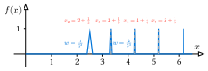

# ch2-w9-1 一致连续与极限证明

## 问题2.9.1

函数$f$在$[0,+\infty)$上一致连续，且对任何$x\in [0,1]$有$\lim\limits_{n\rightarrow \infty}f(x+n)=0\;(n\in \mathbf N^*)$,证明：$\lim\limits_{x\rightarrow +\infty}f(x)=0$.举例说明，仅有$f$在$[0,+\infty)$上的连续性推不出上述结论。

## 证明

因为 $f(x)$ 在 $[0, +\infty)$ 上一致连续，那么对于任意给定的 $\varepsilon > 0$，存在 $\delta > 0$，使得对于任意 $x, y \in [0, +\infty)$，只要 $\vert{}x - y\vert{} < \delta$，就有 $\vert{}f(x) - f(y)\vert{} < \frac{\varepsilon}{2}$。
	

取正整数 $k$ 使得 $\frac{1}{k} < \delta$。我们将区间 $[0,1]$ 进行 $k$ 等分，取分点 $x_i = \frac{i}{k}$，其中 $i = 0, 1, 2, \dots, k$。由题设条件已知，对于每一个固定的分点$x_i$，均有 $\lim\limits_{n\to\infty} f(x_i + n) = 0$。因为分点的个数是有限的（共 $k+1$ 个），所以必定存在一个正整数 $N$，使得当 $n > N$ 时，对于所有的 $i = 0, 1, 2, \dots, k$，同时满足：

$$
\vert{}f(x_i + n)\vert{} < \frac{\varepsilon}{2}
$$

现对任意$x > N + 1$，设其整数部分为 $n = [x]$，那么小数部分为 $t = x - n$。显然 $n > N$ 且 $t \in [0, 1)$。由于相邻两个分点之间的距离为 $\frac{1}{k}$，必存在某个 $x_i$ 使得 $\vert{}t - x_i\vert{} \leqslant \frac{1}{k} < \delta$。此时，考察点 $x$ 与点 $x_i + n$ 之间的距离：

$$
\vert{}x - (x_i + n)\vert{} = \vert{}(n + t) - (x_i + n)\vert{} = \vert{}t - x_i\vert{} < \delta
$$

根据一致连续性，可得：

$$
\vert{}f(x) - f(x_i + n)\vert{} < \frac{\varepsilon}{2}
$$

结合三角不等式，有：

$$
\vert{}f(x)\vert{} \leqslant \vert{}f(x) - f(x_i + n)\vert{} + \vert{}f(x_i + n)\vert{} < \frac{\varepsilon}{2} + \frac{\varepsilon}{2} = \varepsilon
$$

综上，对于任意 $\varepsilon > 0$，存在 $X = N + 1 > 0$，当 $x > X$ 时总有 $\vert{}f(x)\vert{} < \varepsilon$。因此，$\lim\limits_{x\rightarrow +\infty}f(x)=0$ 获证。

构造一个函数，在每个$[n,n+1]$区间内都存在一个“尖峰”，且随着$n$的增大，尖峰的高度不衰减，但越来越窄并向整数点 $n$ 靠拢，使得任意固定的 $x \in [0,1]$ 在平移 $n$ 次后，最终都能完美避开这些尖峰。定义函数 $f(x)$ 的表达式如下：

$$
f(x) = \begin{cases}  1 - n^3 \left\vert{} x - \left(n + \frac{1}{n}\right) \right\vert{}, & x \in \left[n + \frac{1}{n} - \frac{1}{n^3}, n + \frac{1}{n} + \frac{1}{n^3}\right], n \geqslant 2, n \in \mathbf{N}^* \\  0, & \text{其他情况}  \end{cases}
$$

该反例函数的示意图如下：

{ width="600" style="display: block; margin-left: auto; margin-right: auto;"}

从示意图中可以看到，$f(x)$ 由一系列互不重叠的折线尖峰组成（当 $n \geqslant 2$ 时，峰底宽度为 $\frac{2}{n^3}$，均完全落在 $(n, n+1)$ 内），在 $[0, +\infty)$ 上处处连续。对任意固定的 $x \in [0, 1]$：若 $x = 0$，则 $x+n = n$。因为尖峰都在 $(n, n+1)$ 内部，所以当 $n \geqslant 2$ 时 $f(n) = 0$ 恒成立，故 $\lim\limits_{n\to\infty} f(n) = 0$；若 $x \in (0, 1]$，由于 $\lim\limits_{n\to\infty} (\frac{1}{n} + \frac{1}{n^3}) = 0$，当 $n$ 足够大时，必定有 $x > \frac{1}{n} + \frac{1}{n^3}$。这意味着点 $x+n$ 最终会落在第 $n$ 个尖峰的右侧区间，从而对充分大的 $n$ 总有 $f(x+n) = 0$。因此 $\lim\limits_{n\to\infty} f(x+n) = 0$ 成立。

但此时无法推出无穷远处的极限为$0$：在每个尖峰的最高点 $x_n = n + \frac{1}{n}$ 处，函数值恒为 $f(x_n) = 1$。因为 $x_n \to +\infty$ 且 $f(x_n) \equiv 1$，所以 $\lim\limits_{x\rightarrow +\infty}f(x)$ 显然不可能等于$0$，该极限实际上并不存在。结论得证。

### 注：一个失败的反例

考虑那个 [反常性质](ch2-9-1反常函数.md) 的函数：$f(x)=\frac{x}{1+x^2\sin^2 x},\; (x\geqslant 0)$，因为它在 $[0,+\infty)$ 上连续，但是不一致连续。整体图像有一系列无限拔高、无限变窄的“尖刺”组成，这些尖刺位于整数倍的 $\pi$ 处。因此它似乎是满足题意的，因为对于数列 $x_n = n\pi$，函数值 $f(x_n)=n\pi \to +\infty,\;(n\to \infty)$；而对于其他的地方函数值则趋于$0$。

我们可以改进一下这个函数，让它的尖峰出现在 $x_n=n$ 的位置。定义：

$$
g(x) = \frac{x}{1+x^2\sin^2{(\pi x)}}
$$

它是否能组成本题的反例？答案值**不能**的。因为这些尖峰“不能移动”，不能无限得向整数点靠近，而是固定在 $x_n=n$ 的位置！因此不能满足对任何 $x\in [0,1]$ 有 $\lim\limits_{n\to \infty}f(x+n)=0$ 这个条件，因为当 $x=0,1$ 时，这个极限是 $+\infty$。

??? success "查阅详细推证"
    对平移之后的函数值进行化简：
    
    $$g(x+n) = \frac{x+n}{1+(x+n)^2\sin^2(\pi(x+n))}$$
    
    由于 $n$ 是整数，则有：$\sin(\pi(x+n)) = \sin(\pi x + n\pi) = (-1)^n \sin(\pi x)$，平方后负号号消除：
    
    $$g(x+n) = \frac{x+n}{1+(x+n)^2\sin^2(\pi x)}$$
    
    分情况讨论区间 $[0,1]$ 内的点：
    
    **当 $x \in (0, 1)$ 时：** $\sin^2(\pi x)$ 是一个严格大于 0 的常数，记为 $c$。当 $n \to \infty$ 时，分子是关于 $n$ 的一次项，分母是二次项，因此：
    
    $$\lim_{n\to\infty} g(x+n) = \lim_{n\to\infty} \frac{x+n}{1+c(x+n)^2} = 0$$
    
    在开区间内，极限条件满足。
    
    **当 $x = 0$（或 $x = 1$）时：** 此时 $\sin^2(0) = 0$。代入表达式计算整数点序列的值：
    
    $$g(0+n) = g(n) = \frac{n}{1+n^2\sin^2(n\pi)} = \frac{n}{1+0} = n$$
    
    对该序列求极限：
    
    $$\lim_{n\to\infty} g(n) = \lim_{n\to\infty} n = +\infty$$

## 思考：一致连续与一致收敛

如果记：

$$
g_n(t)=f(n+t),\qquad t\in[0,1].
$$

这是一个函数列$\{g_n(t)\}$。题设条件$\lim\limits_{n\rightarrow \infty}f(x+n)=0$ 对于 $x \in [0,1]$ 成立，直接等价于函数列 $g_n(t) \to 0$ 在 $t \in [0,1]$ 上逐点收敛。

而要证的结论： $\lim\limits_{x\rightarrow +\infty}f(x)=0$ 等价于要求对于任意 $\varepsilon > 0$，存在 $N > 0$，当 $n > N$ 时，对所有的 $t \in [0,1]$，都有 $\vert{}f(n+t)\vert{} < \varepsilon$。这恰恰就是 $g_n(t)$ 在 $[0,1]$ 上一致收敛于 $0$（记作 $g_n(t) \rightrightarrows 0$）的严格定义。

将“逐点收敛”跨越到“一致收敛”的桥梁，正是 $f(x)$ 的一致连续性。由于 $g_n(t)$ 是从同一个具有全局一致连续性的母体 $f(x)$ 上“切”下来的，因此 $f(x)$ 在 $[0, +\infty)$ 上的一致连续，直接保证了函数列 $\{g_n(t)\}$ 在 $[0,1]$ 上是\textbf{等度连续}的。函数列的等度连续的定义是：$\forall \,\varepsilon > 0, \exists \,\delta > 0$，使得 $\forall \,n \in \mathbf{N}^*$，以及 $\forall\, t_1, t_2 \in [0,1]$，只要 $\vert{}t_1 - t_2\vert{} < \delta$，就有：

$$
\vert{}g_n(t_1) - g_n(t_2)\vert{} = \vert{}f(n+t_1) - f(n+t_2)\vert{} < \varepsilon
$$

注意这里的 $\delta$ 与 $n$ 无关，这是由 $f$ 的全局一致连续性所决定的，它们共享了$f(x)$一致连续的那个$\delta$。而在紧致空间（本题中是闭区间$[0,1]$）上，有一个经典理论：紧集上的等度连续函数列，若逐点收敛，则必一致收敛。保证从“逐点收敛”提升到“一致收敛”的最底层物理机制，是紧区间上的有限覆盖。

等度连续保证了在任意一点的某个小邻域内，函数列中的所有函数都没有剧烈震荡。这意味着，只要函数在邻域的中心点收敛，那么被等度连续性“绑”在一起的周围点也会跟着收敛。逐点收敛在这里获得了局部的一致性。而闭区间 $[0,1]$ 上有无穷多个点，对于每一个点，我们都能找到上述的一个局部收敛邻域，从而形成该区间的一个无限开覆盖。紧集（闭区间）的核心威力在于有限覆盖定理：因为 $[0,1]$ 是紧致的，我们可以用有限个点 $x_i$ 及其半径为 $\delta$ 的开覆盖来覆盖整个 $[0,1]$。对于 $[0,1]$ 中的任意一点 $t$，它必然落在某个网格节点 $x_i$ 的 $\delta$ 邻域内。由等度连续性，$g_n(t)$ 的值被“钉”在了 $g_n(x_i)$ 的附近，绝不可能产生剧烈震荡从而逃脱 $\varepsilon$ 的控制。

整个物理图像是：等度连续把点变成了“块”（邻域），而有限覆盖定理确保我们只需有限个“块”就能铺满整个空间。

