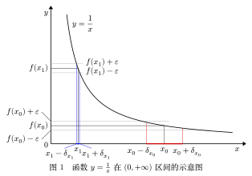

# 一致连续释义

当自变量做了很小的变动时，函数值的变动也很小，直观上这就叫连续。与可导一样，连续是一个局部的概念，是一点一点来定义的：考察在这点是否连续，在那点是否连续，如果函数在一个区间 $I$ 上每一点连续（在左端点右连续，在右端点左连续），则称该函数在整个区间上连续。函数在点 $x_0$ 处连续，即 $\lim\limits_{x\rightarrow x_0}{f(x)}=f(x_0)$，其标准的 $\varepsilon - \delta$ 语言定义是：

$$
\forall \,\varepsilon >0,\;\exists \,\delta>0,~\text{使得当}~|x-x_0|<\delta ~\text{时，有：}|f(x)-f(x_0)|< \varepsilon
$$

其几何意义是：不论平行于横轴的两条直线 $y=f(x_0)\pm \varepsilon$ 所围成的带状区域如何狭窄，一定可以找到一个正数 $\delta$，使得对于平行于纵轴的两条直线 $x=x_0 \pm \delta$ 之间的所有 $x$，相应的曲线段 $y=f(x)$ 能够完全落在 $f(x_0)\pm \varepsilon$ 的带状区域之内。因此看函数在某点是否连续，就看能否找得到这样的 $\delta$。

但是这个 $\delta$，不但与所取定的 $\varepsilon$ 相关，而且对具体的函数而言，它与所考察的点 $x_0$ 的位置也有关系，严谨的说应该记为 $\delta_{x_0}$（或者记为 $\delta(x_0,\varepsilon)$，这里为突出$x_0$ 的作用，省略了$\varepsilon$）。

比如，函数 $y=\frac{1}{x}$ 在 $(0,+\infty)$ 的区间上是连续的，如下图所示。取定某个 $\varepsilon >0$，对于数轴上不同位置的 $x_0$，得到的 ${\delta}_{x_0}$ 并不相同。比较 $x_0$ 与 $x_1~(x_0>x_1>0)$ 处对应的 ${\delta}$，很明显有：${\delta}_{x_0}>{\delta}_{x_1}$。也就是说，当考察的点越靠近 $0$ 时，为了保证函数值不超出 $\varepsilon$ 的范围，所需要的 ${\delta}_{x_0}$ 也越小。

{ width="600" style="display: block; margin-left: auto; margin-right: auto;"}

因此自然会问，能不能在所有的 ${\delta}_{x_0}$ 中，找到一个公共的 $\delta$，使得对于给定的 $\varepsilon >0$，区间内每个点都可以共用这同一个 $\delta$？既然所有的 ${\delta}_{x_0}>0$，这个集合是有下界的，那么根据实数的连续性，它一定存在下确界（但下确界有可能是 $0$）。因此整体性的考虑，一致连续的概念就是问，能否在所有的正数 ${\delta}_{x_0}$ 中，找到大于 $0$ 的下确界：

$$
\inf_{x_0 \in I}{{\delta}_{x_0}}=\delta >0
$$

如果可以找得到这样一个大于 $0$ 的公共 $\delta$，我们说函数在区间 $I$ 上是一致连续的。用严谨的数学语言表述即为：

$\forall\,\varepsilon > 0$，存在一个只依赖于 $\varepsilon$ 的 $\delta > 0$，使得对于区间 $I$ 上的任意两点 $x_1, x_2$，只要 $\vert{}x_1 - x_2\vert{} < \delta$，就有 $\vert{}f(x_1) - f(x_2)\vert{} < \varepsilon$。

在上例中，就找不到这样大于 $0$ 的公共 $\delta$，因为当 $x\rightarrow 0$ 时，对应的 ${\delta}_{x_0} \rightarrow 0$，其下确界是 $0$。因此函数 $f(x)=\frac{1}{x}$ 在区间 $(0,+\infty)$ 上是连续的，但不是一致连续的。

一致连续是一个整体性的概念，是对整个区间而言的，它描述的是函数在区间上的连续性是均匀的、不随位置变化的。在数学分析中，还会遇到很多这类整体性的概念，比如函数列的一致收敛、一致有界、一致逼近。

显然，一致连续的前提是连续。两者的逻辑关系是：一致连续 $\Rightarrow$ 连续，但 连续 $\not\Rightarrow$ 一致连续。何时才能从“连续”，直接推出“一致连续”呢？这就需要给区间加上一个重要的条件：有限闭区间。【即Cantor定理：闭区间上的连续函数一定是一致连续的。】