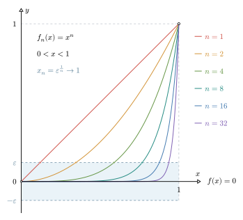
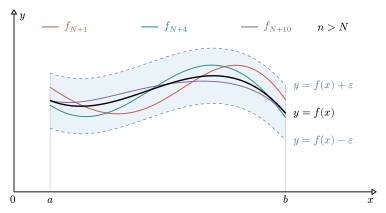

# 何谓一致收敛

设函数列 $\{f_n(x)\}$ 定义在区间 $[a,b]$ 上，如果对于每个固定的 $x\in[a,b]$，都有：

$$
\lim_{n\to\infty}f_n(x)=f(x)
$$

那么就称函数列 $\{f_n(x)\}$ 在 $[a,b]$ 上**逐点收敛**到函数 $f(x)$。

固定一个 $x$，函数列就对应一个数列 $\{f_n(x)\}$。因此函数列收敛到一个函数，就包含了无数个数列的收敛。不过，在不同的位置，这些数列的收敛速度未必是一致的，也就是这些数列达到同一误差要求（所谓的任意正数 $\varepsilon$）所需的项数可能不同。一致收敛所考察的，就是能否对整个区间上的收敛速度进行统一控制。

## 一个收敛速度不一致的例子

考察函数列：

$$
f_n(x)=x^n,\qquad n\in \mathbf N^*,\quad x\in (0,1).
$$

对于每个固定的 $x\in(0,1)$，都有 $\lim\limits_{n\to\infty} x^n = 0$，因此这个函数列在 $(0,1)$ 上逐点收敛到函数 $f(x)=0$。下图展示了 $n=1,2,4,8,16,32$ 时函数的图像。随着 $n$ 的增大，对于固定的 $x$，函数值越来越接近 $0$；同时，曲线急速上升（陡峭）的部分越来越集中在靠近 $x=1$ 的位置。

{ width="500" style="display: block; margin-left: auto; margin-right: auto;"}

对于固定的 $x$，上述收敛过程可以表述为：对于任意的 $\varepsilon > 0$，存在正整数 $N=N(\varepsilon,x)$，使得当 $n>N$ 时，恒有：

$$
\left|f_n(x)-f(x)\right|=x^n<\varepsilon.
$$

这里的 $N$，除了与选定的正数 $\varepsilon$ 有关，还与 $x$ 点的位置有关，因此记作 $N(\varepsilon,x)$。为了说明这种依赖关系，固定 $0< \varepsilon <1$，对上述不等式取以 $10$ 为底的对数，得：

$$
x^n<\varepsilon \implies n\lg{x}<\lg{\varepsilon} \implies n>\frac{\lg \varepsilon}{\lg x}
$$

因此可以取：

$$
N(\varepsilon,x) = \left\lfloor\frac{\lg\varepsilon}{\lg x}\right\rfloor
$$

这样，当整数 $n>N(\varepsilon,x)$ 时，就有 $x^n<\varepsilon$。

例如，如果取定 $\varepsilon = 10^{-100}$，那么在不同的位置：

1. 在 $x_1=10^{-10}$ 处，解得 $N=10$。即从第 $11$ 项开始，才有 ${(x_1)}^n<10^{-100}$；
2. 在 $x_2=10^{-4}$ 处，解得 $N=25$。即从第 $26$ 项开始，才有 ${(x_2)}^n<10^{-100}$；
3. 在 $x_3=10^{-1}$ 处，解得 $N=100$。即从第 $101$ 项开始，才有 ${(x_3)}^n<10^{-100}$；
4. 在 $x_4 = 0.5$ 处，解得 $N=332$。即从 第 $333$ 项开始，才有 ${(x_4)}^n<10^{-100}$；
5. 在 $x_5 = 0.9$ 处，解得 $N=2185$。即从 第 $2186$ 项开始，才有 ${(x_5)}^n<10^{-100}$。

由此可知，对于不同的 $x$，函数列收敛到 $0$ 的速度不一样（不一致）。当 $x$ 越靠近 $0$，数列 $\{f_n(x)\}$ 收敛得越快；随着 $x$ 向 $1$ 靠拢，数列收敛的速度越来越慢，对于同一个误差要求，取到的 $N$ 也就越大，所需的项数也越大。对于固定的 $0<\varepsilon<1$，当 $x\rightarrow 1^-$ 时，有：

$$
\frac{\lg \varepsilon}{\lg x}\to +\infty\quad \implies\quad N(\varepsilon,x)\rightarrow +\infty
$$

因此，无法找到一个对所有 $x\in(0,1)$ 都适用的**公共的** $N$。这说明，函数列 $x^n$ 在区间 $(0,1)$ 上逐点收敛到 $0$，但不一致收敛到 $0$。

## 函数列的一致收敛

**定义：**设函数列 $\{f_n(x)\}$ 和函数 $f(x)$ 定义在区间 $I$ 上，如果对于任意的 $\varepsilon >0$，存在只与 $\varepsilon$ 有关（与 $x$ 无关）的正整数 $N=N(\varepsilon)$，使得当 $n>N$ 时，有：
$$
|f_n(x)-f(x)|<\varepsilon
$$

对任意的 $x \in I$ 都成立，就称函数列 $\{f_n(x)\}$ 在 $I$ 上**一致收敛**到 $f$。记为：$f_n \rightrightarrows f$ 于 $I$。在比较老的中文教材中，也说：$\lim\limits_{n \rightarrow \infty}{f_n(x)}=f(x)$ 在区间 $I$ 上 **一致的成立**。	

其几何意义是明显的，如下图所示，给定 $\varepsilon > 0$ 后，曲线 $y=f(x)+\varepsilon$ 和 $y=f(x)-\varepsilon$ 围成一个带状区域。一致收敛则意味着：当 $n>N$ 时，每条 $f_n$ 的整条图像都落在 $\left(f(x)-\varepsilon,f(x)+\varepsilon\right)$ 的带状区域内。

{ width="600" style="display: block; margin-left: auto; margin-right: auto;"}

回到函数列 $f_n(x)=x^n$。对于任意固定的 $0<\varepsilon<1$，曲线 $y=x^n$ 与带状区域上边界 $y=\varepsilon$ 的交点横坐标为

$$
x_n=\varepsilon^{1/n}
$$

虽然 $x_n\to1$，但对于每个有限的 $n$，仍然有 $x_n<1$。因此，在区间 $\left(\varepsilon^{1/n},1\right)$ 之内，始终有 $x^n>\varepsilon$。那么从几何上看，无论 $n$ 多大，每条曲线在靠近 $1$ 的位置总有一部分超出带状区域；从代数上看，当 $x$ 从左侧趋于 $1$ 时，满足 $x^n<\varepsilon$ 的 $N$ 就趋于无穷大。

所以，逐点收敛允许根据不同的 $x$ 选择不同的 $N$；一致收敛则要求用同一个 $N$ 控制整个区间上的误差。