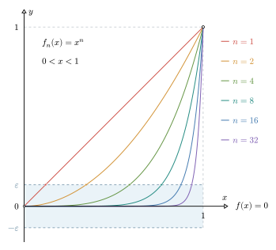

# 关于一致收敛

定义在区间 $[a,b]$ 上的函数列 $\left\{f_n(x)\right\}$ 收敛到 $f(x)$，可以表示为： $\lim\limits_{n\to \infty}{f_n(x)}=f(x),x \in [a,b]$。当 $x$ 在变动时，函数列收敛到一个函数，这就包含了无数个数项级数收敛。在不同的位置，这些数项级数的收敛速度未必是一致的，所谓一致收敛，就是考察函数列收敛速度是否一致。

## 一个收敛速度不一致的例子

考察函数列：

$$
f_n(x)=x^n,\;n\in \mathbf N^*,\,x\in (0,1).
$$

此函数列在 $(0,1)$ 区间上逐点收敛于函数 $f(x)=0$，如下图所示。图像展示了 $n=1,2,4,8,16,32$ 时函数的图像。可知随着 $n$ 的增大，函数越来越陡峭，越来越逼近于 $x=1$。当 $n\to \infty$ 时，对于任意的 $x\in(0,1)$，都有 $x^n \to 0$。

{ width="500" style="display: block; margin-left: auto; margin-right: auto;"}

对于固定的 $x$，这个收敛过程可以表述为：

$$
\forall\,\varepsilon >0,\exists\,N(\varepsilon,x),\text{使得当}\,n>N\,\text{时，有}\left|f_n(x)-f(x)\right|=x^n<\varepsilon.
$$

这里的 $N$，除了与选定的正数 $\varepsilon$ 有关，还与 $x$ 点的位置有关，因此记作 $N(\varepsilon,x)$。为了展示 $N$ 的取值与 $x$ 位置的关系，我们作如下分析：

上述不等式 $x^n<\varepsilon$ 等价于 $n\lg{x}<\lg{\varepsilon}$，其中 $\lg x$ 表示以 $10$ 为底的对数函数。解得：$n>\frac{\lg \varepsilon}{\lg x}$，即可以取 $N=\left[\frac{\lg \varepsilon}{\lg x}\right]$，那么当 $n>N$ 时，就成立 $x^n<\varepsilon$。

如果取定 $\varepsilon = 10^{-100}$，那么：

1. 在 $x_1=10^{-10}$ 处，解得 $N=10$。即 $n>10$ 时，从第 $11$ 项开始，才有 ${(x_1)}^n<10^{-100}$；
2. 在 $x_2=10^{-4}$ 处，解得 $N=25$。即 $n>25$ 时，从第 $26$ 项开始，才有 ${(x_2)}^n<10^{-100}$；
3. 在 $x_3=10^{-1}$ 处，解得 $N=100$。即从第 $101$ 项开始，才有 ${(x_3)}^n<10^{-100}$；
4. 在 $x_4 = 0.5$ 处，解得 $N=332$。即从 第 $333$ 项开始，才有 ${(x_4)}^n<10^{-100}$；
5. 在 $x_5 = 0.9$ 处，解得 $N=2185$。即从 第 $2186$ 项开始，才有 ${(x_5)}^n<10^{-100}$。

由此可知，对于不同的 $x$，函数列收敛到 $0$ 的速度不一样（不一致）。当 $x$ 越靠近 $0$，级数收敛得越快；随着 $x$ 向 $1$ 靠拢，级数收敛的速度越来越慢，取到的 $N$ 也就越来越大，当 $x\rightarrow 1$ 时，$N\rightarrow +\infty$，因此没有**公共的** $N$。这就叫做，函数列 $x^n$ 在区间 $(0,1)$ 上逐点收敛但不一致收敛。

## 函数列的一致收敛

**（一致收敛的定义）**设函数列 $\{f_n(x)\}$ 在区间 $I$ 上收敛到 $f$，如果对于任意的 $\varepsilon >0$，存在只与 $\varepsilon$ 有关的 $N(\varepsilon)$，使得当 $n>N(\varepsilon)$ 时，有：$|f_n(x)-f(x)|<\varepsilon$ 对任意的 $x \in I$ 都成立，此时称 $\{f_n(x)\}$ 在 $I$ 上一致收敛到 $f$。记为：$f_n \rightrightarrows f$，或者说，$\lim\limits_{n \rightarrow \infty}{f_n(x)}=f(x)$ 在区间 $I$ 上 **一致的成立**。	

其几何意义是明显的，如下图所示，就是说当 $n$ 充分大，大于一个**公共的** $N$ 时，所有的函数都落在 $\left(f(x)-\varepsilon,f(x)+\varepsilon\right)$ 的带状区域之内，这个 $N$ 与 $x$ 的位置是无关的。

{ width="600" style="display: block; margin-left: auto; margin-right: auto;"}

但上述例子中，$x^n$ 在 $(0,1)$ 区间就不满足这个性质，从图像上也可以看出，对于 \(0<\varepsilon<1\)，当 $x \rightarrow 1$ 时，由于 $N\to+\infty$，那么不管 $n$ 多大，每条曲线在靠近 \(1\) 的位置总会超出带状区域。