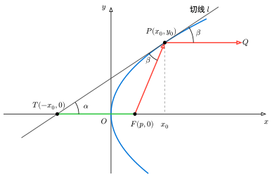

# ch3-2-8 抛物线光学性质

## 题目

证明抛物线的光学性质：若置光源与抛物线的焦点上，经过抛物镜面的反射之后，成为一束平行于抛物线的对称轴的光线。

## 方法一

设抛物线方程为 $y^2 = 4px\;(p > 0)$，那么抛物线的焦点为 $F(p, 0)$。光线从$F$点发出，与抛物镜面交于点$P$，设$P$点的坐标为$(x_0,y_0)$（先假设$y_0 \neq 0$）。光线应以$P$点处的切线为镜面进行反射，如下图所示。记切线$l$与 $x$ 轴的夹角为$\alpha$。根据光的反射定律，入射光线$FP$和反射光线$PQ$与反射面的夹角必须相等，这个夹角记为$\beta$。要证明反射光线$PQ$平行于$x$轴，只要证明$\beta = \alpha$即可。

{ width="500" }

对抛物线方程两边关于 $x$ 求导，得：

$$
2y \frac{\mathrm dy}{\mathrm dx} = 4p \implies \frac{\mathrm dy}{\mathrm dx} = \frac{2p}{y}
$$

因此，过点 $P(x_0, y_0)$ 的切线斜率为 $k = \frac{2p}{y_0}$，切线 $l$ 的方程为：

$$
y - y_0 = \frac{2p}{y_0}(x - x_0)
$$

令 $y = 0$，求该切线与 $x$ 轴的交点 $T$ 的横坐标：

$$
-y_0 = \frac{2p}{y_0}(x - x_0) \implies -y_0^2 = 2p(x - x_0)
$$

因为点 $P$ 在抛物线上，满足 $y_0^2 = 4px_0$，代入上式，得：

$$
-4px_0 = 2px - 2px_0 \implies 2px = -2px_0 \implies x = -x_0
$$

因此，切线与 $x$ 轴交于点 $T(-x_0, 0)$。

焦点 $F(p, 0)$ 到交点 $T(-x_0, 0)$ 的距离$\vert{}FT\vert{}$是：

$$
\vert{}FT\vert{} = p - (-x_0) = x_0 + p
$$

焦点 $F(p, 0)$ 到点 $P(x_0, y_0)$ 的距离$\vert{}FP\vert{}$（亦称为焦半径）是：

$$
\begin{aligned}
	\vert{}FP\vert{} & = \sqrt{(x_0 - p)^2 + y_0^2} = \sqrt{x_0^2 - 2px_0 + p^2 + 4px_0} \\
	& = \sqrt{x_0^2 + 2px_0 + p^2} = \sqrt{(x_0 + p)^2} = x_0 + p
\end{aligned}
$$

因此$\vert{}FT\vert{} = \vert{}FP\vert{}$，这说明 $\triangle FTP$ 是一个等腰三角形，因此底角相等：$\angle FTP = \angle FPT$，即$\alpha = \beta$。这就从几何关系上证明了，反射光线 $PQ$ 平行于 $x$ 轴。

因此，从焦点 $F$ 发出的光线，经过抛物镜面反射后，必然是一束平行于对称轴的光线。当 $y_0 = 0$ 时，点 $P$ 即为抛物线顶点 $(0,0)$。此时光线沿 $x$ 轴射向原点，垂直击中抛物线（切线为 $y$ 轴）后原路反射，依然平行于对称轴（本身就在对称轴上）。

## 方法二

利用线性代数中的向量投影与反射模型，可以将几何问题代数化，更加高效。

设抛物线方程为 $y^2 = 4px\ (p>0)$，其焦点为 $F(p, 0)$。则抛物线的参数方程为：$x(t)=pt^2,y(t)=2pt$，因此抛物线上任意一点 $P$ 均可参数化为 $P\left(pt^2, 2pt\right)$。

从焦点 $F$ 射向 $P$ 的入射光线向量为 $\overrightarrow{FP} = \left(pt^2 - p, 2pt\right) = p\left(t^2 - 1, 2t\right)$。由于正实数标量$p$不影响方向，那么入射方向可以表示为方向向量：$\mathbf{v} = \left(t^2 - 1, 2t\right)$。

对参数方程关于$t$求导，可得抛物线在点$P$处的切向量为$\left(x'(t),y'(t)\right)=(2pt,2p)$，同样地，如果只表示方向，向量的长度无关紧要，因此提出正实数公因子 $2p$ 后，点 $P$ 处的切向量可简化为$\mathbf{T} = (t, 1)$。取与其正交的向量作为法向量，即 $\mathbf{N} = (1, -t)$。

在物理中，镜面反射保持切向分量不变，而将法向分量反向，即：反射向量 = 入射向量$-2$倍的入射向量在法向量上的投影。因此，反射向量 $\mathbf{v}_{\mathrm{out}}$的代数表达式为：

$$
\mathbf{v}_{\mathrm{out}} = \mathbf{v} - 2\frac{\mathbf{v} \cdot \mathbf{N}}{\mathbf{N} \cdot \mathbf{N}}\mathbf{N}
$$

其中$\frac{\mathbf{v} \cdot \mathbf{N}}{\mathbf{N} \cdot \mathbf{N}}$是投影系数，代入已知向量进行计算：

$$
\begin{gathered}
	\mathbf{v} \cdot \mathbf{N} = \left(t^2 - 1\right)\cdot 1 + 2t\cdot (-t) = -\left(t^2 + 1\right)\\
	\mathbf{N} \cdot \mathbf{N} = 1^2 + (-t)^2 = t^2 + 1
\end{gathered}
$$

故投影系数为$-1$，原反射向量公式化简为：

$$
\mathbf{v}_{\mathrm{out}} = \mathbf{v} + 2\mathbf{N} = \left(t^2 - 1, 2t\right) + (2, -2t) = \left(t^2 + 1, 0\right)
$$

因此无论参数 $t$ 取任何实数（包括顶点$t=0$的情况），$t^2+1$ 恒为正，且 $y$ 分量恒为 $0$。这就证明了所有自焦点发出的光线，经抛物线反射后的方向向量均为 $\left(t^2+1, 0\right)$，即完全平行于抛物线的对称轴（$x$ 轴）。
