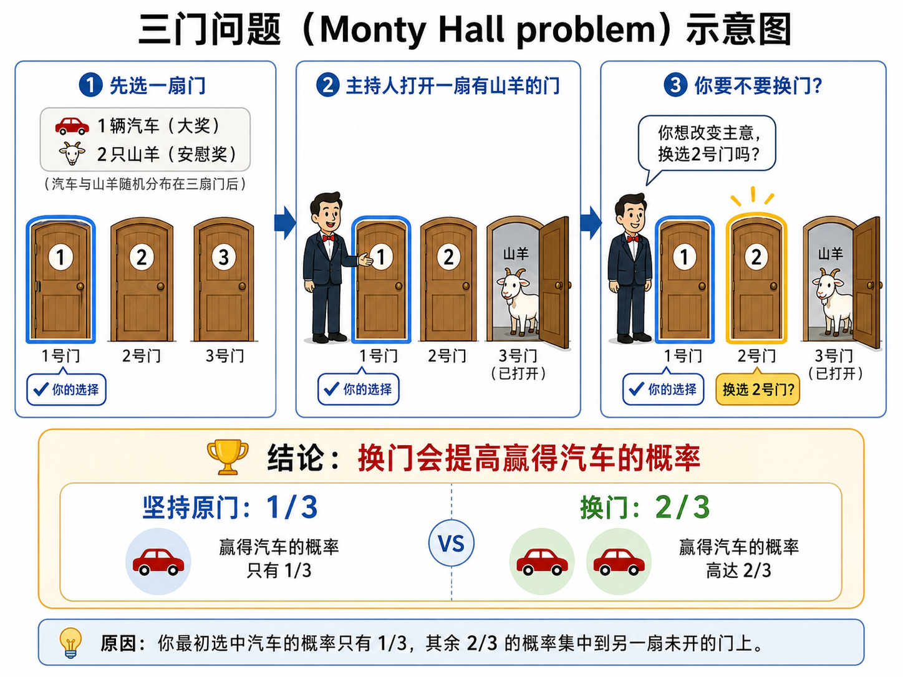

# 三门问题

## 文档下载

**三门问题（Monty Hall problem）**，是一个源自美国电视游戏节目《Let's Make a Deal》的概率问题。这个问题的结论非常违反直觉！

它背后的本质是贝叶斯推断。点击链接，阅读关于 [三门问题的贝叶斯证明](../static/三门问题.pdf) 。

$$
P(B|A)=\frac{P(A|B)P(B)}{P(A)}
$$

$$
\textbf{Posterior} = \textbf{Likelihood} \times \textbf{Prior} \div \textbf{Evidence}.
$$

## 问题简述

假设你正在参加一个游戏节目，你面前有三扇关闭的门。

- 其中一扇门后面是一辆**汽车**（大奖）。
- 另外两扇门后面各是一只**山羊**（安慰奖）。

游戏规则如下：

1. 你首先选择一扇门（假设你选了1号门），但这扇门暂时不打开。
2. 知道门后秘密的主持人，会在剩下的两扇门中，打开一扇**后面是山羊**的门（假设他打开了3号门）。
3. 此时，主持人会问你：“**你想改变主意，换选2号门吗？**”

**核心问题：** 换门会增加你赢得汽车的概率吗？

**结论：** **必须换！** 坚持不换的胜率是 $1/3$，而换门的胜率会翻倍，达到 **$2/3$**。

以下是对该游戏的一个示意图：

{width="700"}

