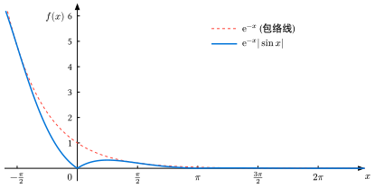

# 绝对值周期函数的积分

## 题目
求：

$$
I=\int_0^{+\infty}\mathrm e^{-x}|\sin x|\,\mathrm dx
$$

**分析：**被积函数的图像如下所示：它整体以指数的趋势衰减，但同时又遵循某种固定周期的重复。请参考 [函数方程证明周期函数](../第2章 函数的连续性/ch2-w3-2函数方程证明周期函数.md)，它属于函数方程 $f(x+T) = kf(x)$ 所决定的函数家族。 

{ width="600" style="display: block; margin-left: auto; margin-right: auto;"}

因为被积函数具备某种周期重复（可称为绝对值周期，不是严格意义的周期函数），同时积分区间是无穷大，因此利用分部积分的时候，会得到一个无穷级数，这正是本积分的难点。

## 一个很不错的解法

令 $x+\pi=t$，则 $x=t-\pi$ 及 $\mathrm d x = \mathrm dt$，积分上下限变为 $\pi$ 和 $+\infty$。原积分变为：

$$
\begin{aligned}
I & = \int_{\pi}^{+\infty}\mathrm e^{-(t-\pi)}|-\sin t|\,\mathrm d t \\ &= \mathrm e^{\pi}\int_{\pi}^{+\infty}\mathrm e^{-t}|\sin t|\,\mathrm d t \\ &=\mathrm e^{\pi}\left(I-\int_0^{\pi}\mathrm e^{-x}\sin x\,\mathrm dx\right)\end{aligned}
$$

令

$$
J =\int_0^{\pi}\mathrm e^{-x}\sin x\,\mathrm dx
$$

则：

$$
I = \mathrm e^{\pi}(I-J)\implies I = \frac{\mathrm e^{\pi}}{\mathrm e^{\pi}-1}\cdot J
$$

两次利用分部积分法计算 $J$，或直接使用公式$\displaystyle \int \mathrm{e}^{at}\sin(bt)\,\mathrm{d}t = \frac{\mathrm{e}^{at}}{a^2+b^2}(a\sin bt - b\cos bt)$，其中令 $a=-1, b=1$，可得：

$$
J = \frac{\mathrm e^{-\pi}+1}{2}
$$

因此，原积分：

$$
I =\frac{\mathrm e^{\pi}}{\mathrm e^{\pi}-1}\cdot \frac{\mathrm e^{-\pi}+1}{2} = \frac{1}{2}\cdot \frac{\mathrm e^{\pi}+1}{\mathrm e^{\pi}-1}  
$$

为使结果更简洁，可分子分母同乘 $\mathrm e^{-\pi/2}$，转化为双曲余切函数表示：

$$
I =\frac{1}{2}\cdot \frac{\mathrm e^{\pi/2}+\mathrm e^{-\pi/2}}{\mathrm e^{\pi/2}-\mathrm e^{-\pi/2}}=\frac{1}{2}\coth \left(\frac{\pi}{2}\right)  
$$

> 利用了被积函数的**自相似性（Self-similarity）**，通过一次简单的平移变换 $x = t - \pi$，规避掉无穷级数求和。对于这类带有指数衰减和绝对值周期的广义积分，这确实是最优雅的解法。

## 拉普拉斯变换的方法

观察原积分，会发现它完美契合拉普拉斯变换的定义式：

$$
\mathscr{L}\{f(x)\}(s) = \int_0^{+\infty} \mathrm{e}^{-sx} f(x) \,\mathrm{d}x
$$

当我们令 $f(x) = \vert{}\sin x\vert{}$ 且 $s = 1$ 时，原积分恰好就是：

$$
 I = \mathscr{L}{\vert{}\sin x\vert{}} \Big\vert{}_{s=1}  
$$

具体求解步骤如下： 

**第一步：利用周期函数的拉普拉斯变换定理** 

对于周期为$T$的函数$f(x)$，其拉普拉斯变换公式为：

$$
   \mathscr{L}\{f(x)\}(s) = \frac{1}{1 - \mathrm{e}^{-sT}} \int_0^T \mathrm{e}^{-sx} f(x) \,\mathrm{d}x   
$$

已知$f(x) = \vert{}\sin x\vert{}$ 是周期函数，周期 $T = \pi$。代入公式得：

$$
   \mathscr{L}\{\vert{}\sin x\vert{}\}(s) = \frac{1}{1 - \mathrm{e}^{-\pi s}} \int_0^{\pi} \mathrm{e}^{-sx} \sin x \,\mathrm{d}x   
$$

注意：在  $[0, \pi]$ 区间内，$\sin x \geqslant 0$，因此可以直接去掉绝对值。 

**第二步：计算单周期的积分** 

计算定积分 $\displaystyle\int_0^{\pi} \mathrm{e}^{-sx} \sin x \,\mathrm{d}x$。同样利用公式 $\displaystyle\int \mathrm{e}^{ax}\sin(bx)\,\mathrm{d}x = \frac{\mathrm{e}^{ax}}{a^2+b^2}(a\sin bx - b\cos bx)$，令 $a = -s, b = 1$ 得：

$$
\int_0^{\pi} \mathrm{e}^{-sx} \sin x \,\mathrm{d}x = \left[ \frac{\mathrm{e}^{-sx}}{s^2+1}(-s\sin x - \cos x) \right]_0^{\pi}= \frac{\mathrm{e}^{-\pi s} + 1}{s^2 + 1}
$$

**第三步：得出变换式并代入 $s=1$** 

将单周期积分结果代回拉普拉斯变换公式中，得到 $\vert{}\sin x\vert{}$ 的拉普拉斯变换一般表达式：

$$
\mathscr{L}{\vert{}\sin x\vert{}}(s) = \frac{1}{1 - \mathrm{e}^{-\pi s}} \cdot \frac{\mathrm{e}^{-\pi s} + 1}{s^2 + 1}  
$$

令 $s = 1$ 即可求得原定积分的值：

$$
I = \mathscr{L}{\vert{}\sin x\vert{}}(1) = \frac{1}{1 - \mathrm{e}^{-\pi}} \cdot \frac{\mathrm{e}^{-\pi} + 1}{1^2 + 1} = \frac{1}{2} \cdot \frac{1 + \mathrm{e}^{-\pi}}{1 - \mathrm{e}^{-\pi}} = \frac{1}{2} \coth\left(\frac{\pi}{2}\right) 
$$

这与之前得到的结论完全一致。

> 使用拉普拉斯变换的好处在于，它将**无穷区间的积分问题**直接转化为了**代数运算和有限区间的积分问题**，这是一种非常系统化的工具。
