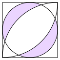
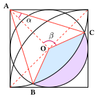

**题目：**求阴影部分的面积，设正方形的边长为$a$.

{ width="200" }

**解：**设$O$为内切圆的圆心（即正方形中心），点$B$和$C$是内切圆与大圆弧的交点。做辅助线如下图所示：

{ width="250" }

角$\alpha$和$\beta$是$\triangle AOC$的两个顶角。易知三角形$AOC$的三个边长分别为：$OA=\dfrac{\sqrt 2}{2}a,AC=a,OC=\dfrac{a}{2}$，应用余弦定理，计算两个顶角：

$$
\begin{aligned}
\cos \alpha &= \frac{1^2+\left({\sqrt 2}/{2}\right)^2-\left({1}/{2}\right)^2}{\sqrt2}=\frac{5\sqrt2}{8} \\
\cos \beta &= \frac{\left({\sqrt 2}/{2}\right)^2+\left({1}/{2}\right)^2-1^2}{\sqrt2/2}=-\frac{\sqrt2}{4}
\end{aligned}
$$

三角形$\triangle AOC$的面积是：

$$
S_{\triangle AOC}=\frac12\cdot AC\cdot OA \cdot \sin \alpha=\frac{\sqrt 2}{4}a^2\sin \alpha
$$

由圆心$A$发出的扇形 $ABC$ 的圆心角为 $2\alpha$，半径为$AC=a$，因此它的面积（记为$S_1$）是：

$$
S_1 = \alpha a^2
$$

定义蓝色${\color{#D4EBFF}\rule{.8em}{.8em}}$区域的面积为$S_2$，它是由上述扇形$ABC$扣除两个全等的三角形 $\triangle AOC$ 和 $\triangle AOB$ 所形成，因此：

$$
S_2=S_1-2S_{\triangle AOC}=\left(\alpha -\frac{\sqrt 2}{2}\sin \alpha\right) a^2
$$

由圆心$O$发出，半径为$OC$的扇形$OBC$（对应内切圆的圆心角为 $2\pi - 2\beta$ 的部分）的面积记为$S_3$，由于其圆心角为$2\pi-2\beta$，半径为$OC=\dfrac{a}{2}$，因此其面积为：

$$
S_3 = \frac12 (2\pi-2\beta)\left(\frac{a}{2}\right)^2 = \frac14 (\pi - \beta)a^2
$$

定义浅紫色${\color{#EBD4FF}\rule{.8em}{.8em}}$区域的面积为$S^*$，则有：

$$
S^*=S_3-S_2=\left[\frac14 (\pi - \beta) - \alpha + \frac{\sqrt 2}{2}\sin \alpha\right]a^2
$$

那么待求的阴影部分面积是$2S^*$，即：

$$
S=2\left(S_3-S_2\right)=\left[\frac12 (\pi - \beta) -2\alpha + \sqrt 2\sin \alpha\right]a^2
$$

对上式进行三角恒等变换：

- 利用反三角函数恒等式 $\arccos(-x) = \pi - \arccos(x)$，对第一项中的 $\pi-\beta$ 进行化简：

$$
\frac{1}{2}(\pi - \beta) = \frac{1}{2}\left[\pi - \arccos\left(-\frac{\sqrt{2}}{4}\right)\right] = \frac{1}{2}\arccos\left(\frac{\sqrt{2}}{4}\right)
$$

- 因为$\cos \alpha = \dfrac{5\sqrt2}{8}$，则有：$\alpha = \arccos \left(\dfrac{5\sqrt2}{8}\right)$.
- 由$\cos \alpha = \dfrac{5\sqrt2}{8}$，可得：$\sin \alpha = \sqrt{1-\dfrac{50}{64}}=\dfrac{\sqrt{14}}{8}$，那么：$\sqrt2\sin \alpha = \dfrac{\sqrt{7}}{4}$.

综上，阴影部分的面积是：

$$
S=\left[\frac{1}{2}\arccos\left(\frac{\sqrt{2}}{4}\right)-2 \arccos \left(\frac{5\sqrt2}{8}\right)+\frac{\sqrt{7}}{4}\right]a^2
$$

